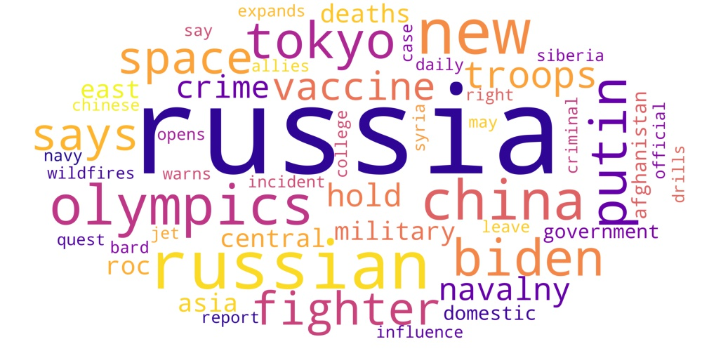

# Облако слов по заголовкам англоязычных статей с сайта google news (https://news.google.com)

### Результат
В папку **./out** выгружается *картинка облака слов* в формате .jpg и файл *googlenews_result.xlsx*. 

В файле googlenews_result содержатся результаты запроса (заголовки статей, ссылки на статьи...). В столбце title - наименования статей найденных по ключевой фразе за заданный период времени. В столбце tokens - простые формы слов, к которым были приведены заголовки статей. По столбцу tokens строится облако слов.
Для анализа контекста слова из облака используйте колонку tokens и ссылки на конкретные статьи, находящиеся в соответствующих строках.



### Запуск программы
Скачайте файлы Google_article.py и requirements.txt в общую папку. 
Программа работает в Python3.

Установите библиотеки и зависимости согласно файлу requirements.txt:
```
$ pip install -r requirements.txt
```

Выполните в консоли команду: 
```
$ python3 Google_article.py 
```
или укажите путь к файлу:
```
$ python3 ~/home/... /Google_article.py
```
Далее программа попросит ввести несколько параметров для формирования запроса к google news. 

Если просто нажимать [ввод], то будет выполнен **запрос по умолчанию**:

- период: 30d (30 дней)
- ключевое слово: Russia
- регион поиска: United States.

---
© [Сергей Злобин](http://sz.pfolio.website.yandexcloud.net/)
